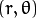
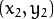

# HoughLines

​	使用OpenCV的以下函数 [HoughLines](http://opencv.willowgarage.com/documentation/cpp/imgproc_feature_detection.html?#cv-houghlines) 和 [HoughLinesP](http://opencv.willowgarage.com/documentation/cpp/imgproc_feature_detection.html?#cv-houghlinesp) 来检测图像中的直线。

## 原理

### 霍夫曼变线

1. 霍夫线变换是一种用来寻找直线的方法.
2. 是用霍夫线变换之前, 首先要对图像进行边缘检测的处理，也即霍夫线变换的直接输入只能是边缘二值图像.


#### 如何实现

1. 众所周知, 一条直线在图像二维空间可由两个变量表示. 例如:

   1. 在 **笛卡尔坐标系:** 可由参数:  斜率和截距表示.
   2. 在 **极坐标系:** 可由参数:  极径和极角表示

   
   <div align=center>
      
   </div>
   

   对于霍夫变换, 我们将用 *极坐标系* 来表示直线. 因此, 直线的表达式可为:

   <div align=center>
      
   </div>

   化简得: 

2. 一般来说对于点 , 我们可以将通过这个点的一族直线统一定义为:

   <div align=center>
      
   </div>

   这就意味着每一对  代表一条通过点  的直线.

3. 如果对于一个给定点  我们在极坐标对极径极角平面绘出所有通过它的直线, 将得到一条正弦曲线. 例如, 对于给定点  and  我们可以绘出下图 (在平面  - ):

   
   <div align=center>
      
   </div>

   只绘出满足下列条件的点  and .

4. 我们可以对图像中所有的点进行上述操作. 如果两个不同点进行上述操作后得到的曲线在平面  -  相交, 这就意味着它们通过同一条直线. 例如, 接上面的例子我们继续对点: ,  和点 ,  绘图, 得到下图:

   
   <div align=center>
      
   </div>

   这三条曲线在  -  平面相交于点 , 坐标表示的是参数对 () 或者是说点 , 点  和点  组成的平面内的的直线.

5. 那么以上的材料要说明什么呢? 这意味着一般来说, 一条直线能够通过在平面  -  寻找交于一点的曲线数量来 *检测*. 越多曲线交于一点也就意味着这个交点表示的直线由更多的点组成. 一般来说我们可以通过设置直线上点的 *阈值* 来定义多少条曲线交于一点我们才认为 *检测* 到了一条直线.

6. 这就是霍夫线变换要做的. 它追踪图像中每个点对应曲线间的交点. 如果交于一点的曲线的数量超过了 *阈值*, 那么可以认为这个交点所代表的参数对  在原图像中为一条直线.


#### 标准霍夫线变换和统计概率霍夫线变换

OpenCV实现了以下两种霍夫线变换:

1. **标准霍夫线变换**

   - 原理在上面的部分已经说明了. 它能给我们提供一组参数对  的集合来表示检测到的直线
   - 在OpenCV 中通过函数 [HoughLines](http://opencv.willowgarage.com/documentation/cpp/imgproc_feature_detection.html?#cv-houghlines) 来实现

2. **统计概率霍夫线变换**

   - 这是执行起来效率更高的霍夫线变换. 它输出检测到的直线的端点 
   - 在OpenCV 中它通过函数 [HoughLinesP](http://opencv.willowgarage.com/documentation/cpp/imgproc_feature_detection.html?#cv-houghlinesp) 来实现


## 代码解释

1. 首先申明变量：

   ```c++
   // 全局变量
   Mat src;
   Mat dst, detected_edges, cdst;
   //Canny参数
   int lowThreshold_Canny = 20;
   int const max_lowThreshold_Canny = 150;
   int ratio = 3;
   int kernel_size = 3;
   int edgeThresh = 1;
   //Hough参数
   int lowThreshold_Hough = 100;
   int const max_lowThreshold_Hough = 200;
   
   char* window_name = "Edge Map";
   bool flag = false;// true:HoughLines  false:HoughLinesP
   ```

2. 加载图片 ：

   ```c++
   // 装载图像
   src = imread("house.jpg");
   if (!src.data)
   {
   	return -1;
   }
   ```

3. 创建显示窗口：

```c++
   // 创建显示窗口
   namedWindow(window_name, CV_WINDOW_AUTOSIZE);
```

4. 创建trackbar，获取阀值：

   ```c++
   // 创建trackbar
   createTrackbar("Canny Threshold", window_name, 
                     &lowThreshold_Canny, max_lowThreshold_Canny, Operations);
   createTrackbar("Hough Threshold", window_name, 
                     &lowThreshold_Hough, max_lowThreshold_Hough, Operations);
   ```

5. Canny处理+灰度处理：

   ```c++
   //Canny处理&灰度处理
   Canny(src, dst, lowThreshold_Canny, lowThreshold_Canny*ratio, kernel_size);
   cvtColor(dst, cdst, CV_GRAY2BGR);
   ```


6. HoughLines（或HoughLinesP）画线：

   ```c++
   if (flag)
   {
   	vector<Vec2f> lines;
   	if (lowThreshold_Hough == 0)
   		HoughLines(dst, lines, 1, CV_PI / 180, 1, 0, 0);
   	else
   		HoughLines(dst, lines, 1, CV_PI / 180, lowThreshold_Hough, 0, 0);
       
   	for (size_t i = 0; i < lines.size(); i++)
   	{
   		float rho = lines[i][0], theta = lines[i][1];
   		Point pt1, pt2;
   		double a = cos(theta), b = sin(theta);
   		double x0 = a*rho, y0 = b*rho;
   		pt1.x = cvRound(x0 + 1000 * (-b));
   		pt1.y = cvRound(y0 + 1000 * (a));
   		pt2.x = cvRound(x0 - 1000 * (-b));
   		pt2.y = cvRound(y0 - 1000 * (a));
   		line(cdst, pt1, pt2, Scalar(0, 0, 255), 1, CV_AA);
   	}
   }
   else
   {
   	vector<Vec4i> lines;
   	if (lowThreshold_Hough == 0)
   		HoughLinesP(dst, lines, 1, CV_PI / 180, 1, 1, 10);
   	else
   		HoughLinesP(dst, lines, 1, CV_PI / 180, 
                       lowThreshold_Hough, lowThreshold_Hough, 10);
   
   	for (size_t i = 0; i < lines.size(); i++)
   	{
   		Vec4i l = lines[i];
   		line(cdst, Point(l[0], l[1]), Point(l[2], l[3]), Scalar(0, 0, 255), 1, CV_AA);
   	}
   }
   ```


7. 显示图像：

   ```c++
   imshow(window_name, cdst);
   ```

   